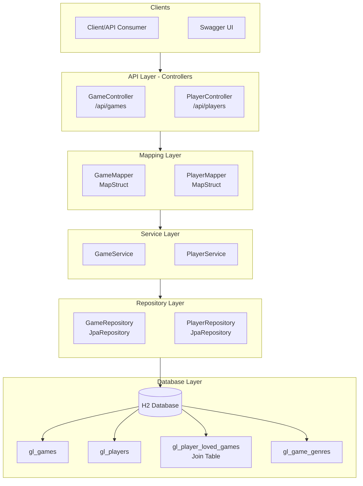
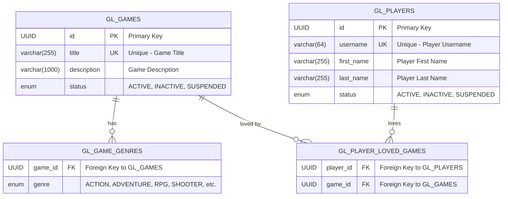

# Game Love API :video_game: :heart:

> Game Love API is a simple and lightweight RESTful API designed for recording games loved by players and check out most
> popular games loved by the players.

## :card_index: Table of Contents

1. Overview
2. Features
3. Architecture
4. Technology Stack
5. Database Schema
6. API Endpoints
7. Getting Started
8. Building and running
9. Testing
10. Project Structure

## :mag_right: Overview

This is a RESTful API implemented with Spring Boot that allows users to record games they love and retrieve a list of
the most popular games. The API provides endpoints for CRUD operations on Games Resource and Players Resource.

Requirements for this API are specified [here](https://github.com/comeon-group/comeon-gamelove-assignment)

> :fire: A more complete version of this project with additional features and improvements can be found at
> [GameOn API](https://github.com/harsha-amarasiri/game-on-api).
> This project is implemented with DDD principles includes technologies and patterns including *Soft Deletes, JPA
> Auditing, Entity Versioning, Database Migrations,Pagination, Global Exception Handling, Enhanced API error handling
> and more.*

## :bulb: Features

- Love a Game: Players can express love for their favorite games
- Unlove a Game: Remove love for a previously loved game
- Player's Loved Games: Retrieve all games loved by a specific player
- Most Loved Games: Get top N most loved games with love counts
- Game Catalog: Fetch all available games in the system
- Embedded Database: Uses H2 in-memory database for easy setup and testing

## :computer: Architecture

Application implements a layered architecture with the following components:

Architectural Decisions:

| ADR # | Title                                                                      | Decision                                                                     | Reasoning                                                                                                                                      |
|-------|----------------------------------------------------------------------------|------------------------------------------------------------------------------|------------------------------------------------------------------------------------------------------------------------------------------------|
| 0001  | Use layered architecture with domain isolation                             | Using DTOss to isolate domain from API                                       | Prevent exposure of domain and sensitive information through public APIs                                                                       |
| 0002  | Strict persistence and domain layer isolation not enforced                 | Spring Data JPA repositories used to perform persistence operations          | To prevent overengineering with multiple DTO mappings and XML defined persistence contexts, domain layer has to retain persistence annotations |   
| 0003  | Use MapStruct for mapping between domain objects and data transfer objects | Use MapStruct for mapping between domain objects and data transfer objects   | Mapstruct provides robust/performant annotations based API for mapping domain to DTOs and vice versa                                           | 
| 0004  | Love/Unlove operations implementation                                      | Loving and unloving games are operations of '/api/players/ resource          | Loving/unloving games are performed by a player, therefore defined as an action upon player resource                                           |
| 0005  | Game Player 'many-to-many' mapping                                         | Players and their loves for the game mapped directly with a mapping table    | To retain the simplicity of the implementation, ownership of the game is not considered                                                        |
| 0006  | Love/Unlove endpoints implementation                                       | Love/Unlove endpoints are implemented as partial updates with 'PATCH' method | Loving and unloving does not update the properties of the player domain, but modifies an associated collection                                 |

## :nut_and_bolt: Technology Stack

- Java 21
- Spring Boot 3.5.7
- Spring Data JPA
- MapStruct
- H2 Database (local file-based)
- Swagger UI
- Lombok
- JUnit 5
- Mockito

## :floppy_disk: Database Schema

## :link: API Endpoints

> API endpoints are documented using [Swagger UI](http://localhost:8080/swagger-ui.html).

### PlayerController

| Method | Endpoint                                |
|--------|-----------------------------------------|
| GET    | /api/players/                           |
| GET    | /api/players/{id}                       |
| POST   | /api/players/                           |
| PUT    | /api/players/{id}                       |
| PATCH  | /api/players/{id}/games/{gameId}/love   |
| PATCH  | /api/players/{id}/games/{gameId}/unlove |
| PATCH  | /api/players/{id}/status                |
| DELETE | /api/players/{id}                       |

### GameController

| Method | Endpoint                 |
|--------|--------------------------|
| GET    | /api/games/              |
| GET    | /api/games/popular       |
| GET    | /api/games/stats/popular |
| GET    | /api/games/{id}          |
| POST   | /api/games/              |
| PUT    | /api/games/{id}          |
| PATCH  | /api/games/{id}/status   |
| DELETE | /api/games/{id}          |
| GET    | /api/games/genres        |

## :rocket: Getting Started

### :arrow_forward: Prerequisites

- Java 21
- Maven 3.8.5
- Git 2.36.2
- IDE of your choice (e.g. IntelliJ IDEA, Eclipse, etc.)

### :play: Running the application

1. Clone the repository
2. Run `mvn spring-boot:run -Dspring-boot.run.profiles=dev`
3. Open [http://localhost:8080/swagger-ui.html](http://localhost:8080/swagger-ui.html) to view the API documentation
4. Explore the API endpoints

> :warning: If maven compiler errors occur due to compiler version mimatch, try following:
>
> Run `$ JAVA_HOME=<your_java_21_home> mvn spring-boot:run -Dspring-boot.run.profiles=dev`.

### Testing

> :white_check_mark: Tested on Fedora 42, Temurin Java 21.0.8 and Maven 3.9.9

## :file_folder: Project Structure

